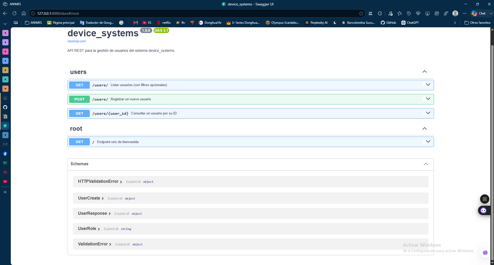
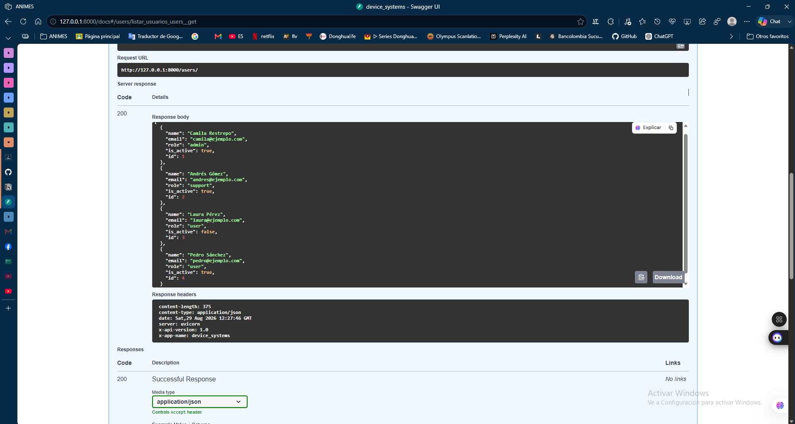
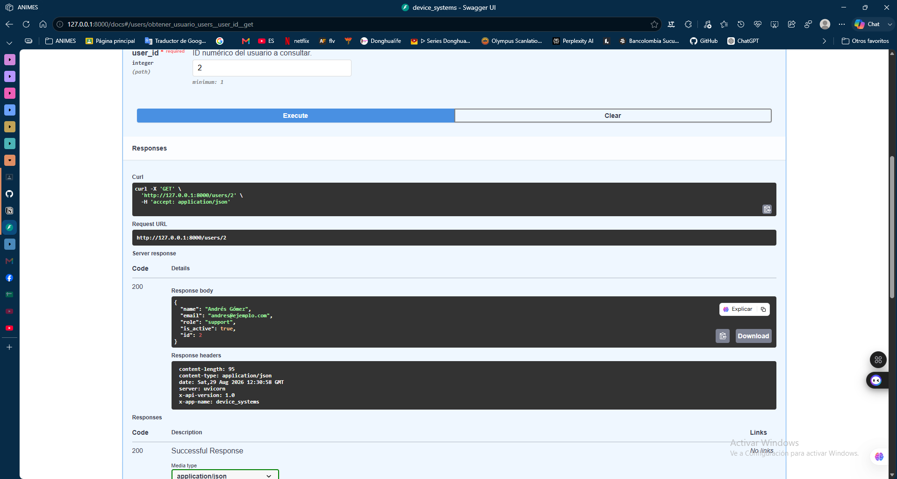
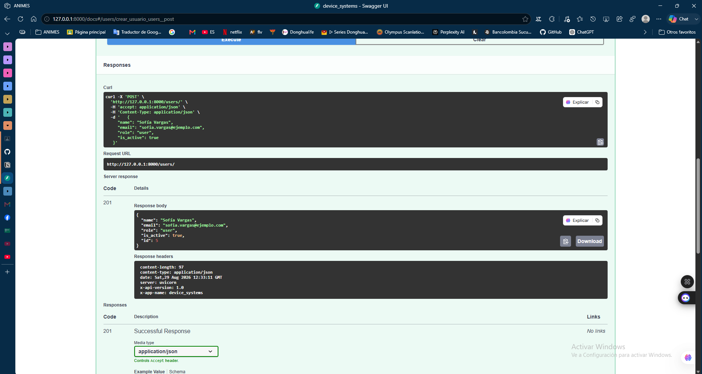
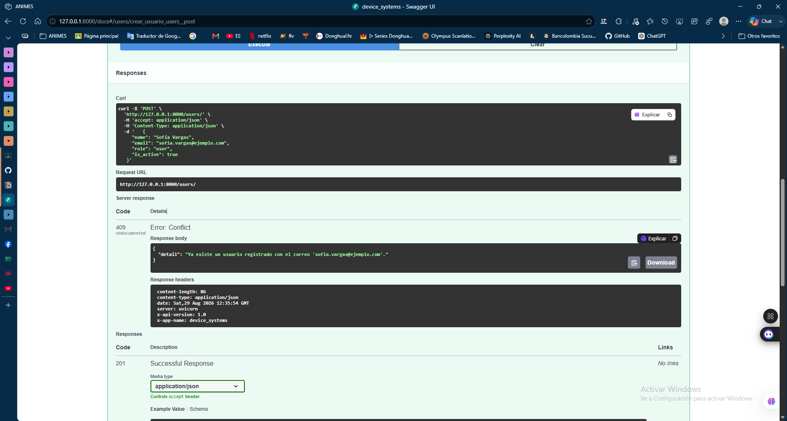
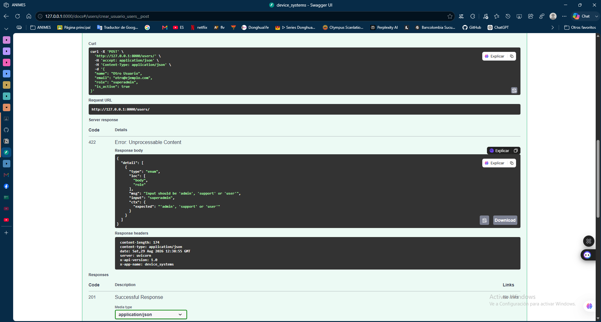

# device_systems — API REST para Gestión de Usuarios

Proyecto integrador de la actividad **GA1-220501096-01-AA1-EV07 — Fundamentos de FastAPI**. API REST construida con **FastAPI** y **Pydantic v2** para administrar el recurso `users` del sistema `device_systems`.

## 📋 Descripción de la aplicación

`device_systems` expone una API REST que permite:
- Listar usuarios, con filtros opcionales por **rol** y **estado activo**.
- Consultar un usuario específico por su **ID**.
- Registrar nuevos usuarios, con **validación completa de datos** (Pydantic) y **prevención de correos duplicados**.
- Todas las respuestas incluyen **cabeceras HTTP personalizadas** (`X-App-Name`, `X-API-Version`).
- Los datos internos de auditoría nunca se exponen al cliente gracias al uso de **response models**.

Los datos se guardan en memoria (no hay base de datos externa) — es suficiente para el alcance de este reto académico; el servidor arranca con 4 usuarios de ejemplo ya cargados.

## 📁 Estructura del proyecto

```
device_systems/
├── app/
│   ├── __init__.py
│   ├── main.py                # Instancia de FastAPI, middleware, endpoint raíz
│   ├── schemas/
│   │   ├── __init__.py
│   │   └── user_schema.py     # Modelos Pydantic (UserBase, UserCreate, UserResponse, UserInDB)
│   └── routes/
│       ├── __init__.py
│       └── user_routes.py     # Endpoints GET y POST de /users
├── images/                    # Capturas de Swagger UI y pruebas
├── requirements.txt
├── .gitignore
└── README.md
```

## ⚙️ Instalación de dependencias

```bash
git clone https://github.com/MAICOL-ESNEIDER/device_systems.git
cd device_systems

python -m venv venv
venv\Scripts\Activate.ps1        # Windows (PowerShell)
# source venv/bin/activate       # Linux/Mac

pip install -r requirements.txt
```

Dependencias principales: `fastapi`, `uvicorn`, `pydantic`, `email-validator` (necesario para validar el formato del campo `email`).

## ▶️ Ejecución del servidor

```bash
uvicorn app.main:app --reload
```

- API disponible en: `http://127.0.0.1:8000`
- **Swagger UI** (documentación interactiva, recomendado para probar): `http://127.0.0.1:8000/docs`
- ReDoc (documentación alternativa): `http://127.0.0.1:8000/redoc`

---

## 🧩 Modelo de datos: `User`

| Campo | Tipo | Validación |
|---|---|---|
| `id` | `int` | Asignado automáticamente por el servidor (no se envía en el POST) |
| `name` | `str` | Obligatorio, mínimo 3 caracteres |
| `email` | `str` (email) | Obligatorio, debe tener formato de correo válido |
| `role` | `str` (enum) | Obligatorio, solo permite: `admin`, `support`, `user` |
| `is_active` | `bool` | Opcional, `true` por defecto |

El proyecto separa 3 modelos Pydantic (`app/schemas/user_schema.py`):
- **`UserCreate`**: lo que el cliente *envía* al crear un usuario (sin `id`).
- **`UserResponse`**: lo que la API *devuelve* al cliente (con `id`, sin datos internos).
- **`UserInDB`**: cómo se guarda el usuario *internamente*, incluyendo un campo `notes` de auditoría que **nunca** se expone — es el `response_model` (`UserResponse`) el que se encarga de filtrarlo automáticamente.

---

## 🌐 Tabla de endpoints

| Método | Ruta | Descripción | Código de éxito |
|---|---|---|---|
| `GET` | `/` | Endpoint raíz de bienvenida | 200 |
| `GET` | `/users` | Lista todos los usuarios | 200 |
| `GET` | `/users?role=admin` | Filtra usuarios por rol (query parameter) | 200 |
| `GET` | `/users?is_active=true` | Filtra usuarios por estado activo (query parameter) | 200 |
| `GET` | `/users/{user_id}` | Consulta un usuario por ID (path parameter) | 200 / 404 |
| `POST` | `/users` | Registra un nuevo usuario | 201 / 409 / 422 |

Todas las respuestas incluyen las cabeceras personalizadas `X-App-Name: device_systems` y `X-API-Version: 1.0`, añadidas por un middleware global en `main.py`.

---

## 🧪 Ejemplos de peticiones (probados con TestClient antes de subir el proyecto)

### GET /users
```
GET /users
```
```json
[
  {"name": "Camila Restrepo", "email": "camila@ejemplo.com", "role": "admin", "is_active": true, "id": 1},
  {"name": "Andrés Gómez", "email": "andres@ejemplo.com", "role": "support", "is_active": true, "id": 2},
  {"name": "Laura Pérez", "email": "laura@ejemplo.com", "role": "user", "is_active": false, "id": 3},
  {"name": "Pedro Sánchez", "email": "pedro@ejemplo.com", "role": "user", "is_active": true, "id": 4}
]
```

### GET /users?role=admin
```json
[
  {"name": "Camila Restrepo", "email": "camila@ejemplo.com", "role": "admin", "is_active": true, "id": 1}
]
```

### GET /users/2
```json
{"name": "Andrés Gómez", "email": "andres@ejemplo.com", "role": "support", "is_active": true, "id": 2}
```

### GET /users/999 (no existe) → 404
```json
{"detail": "No se encontró ningún usuario con id 999."}
```

### POST /users (caso válido) → 201
Body enviado:
```json
{"name": "Sofía Vargas", "email": "sofia@ejemplo.com", "role": "user", "is_active": true}
```
Respuesta:
```json
{"name": "Sofía Vargas", "email": "sofia@ejemplo.com", "role": "user", "is_active": true, "id": 5}
```
*(el campo interno `notes` se guarda pero no aparece en la respuesta — así se comprueba que el `response_model` funciona)*

### POST /users (correo duplicado) → 409
```json
{"detail": "Ya existe un usuario registrado con el correo 'sofia@ejemplo.com'."}
```

### POST /users (nombre muy corto) → 422
```json
{"detail": [{"type": "string_too_short", "loc": ["body", "name"], "msg": "String should have at least 3 characters", "input": "Al"}]}
```

### POST /users (rol inválido) → 422
```json
{"detail": [{"type": "enum", "loc": ["body", "role"], "msg": "Input should be 'admin', 'support' or 'user'", "input": "superadmin"}]}
```

---

## 🖥️ Capturas de Swagger UI

**Swagger UI — vista general de los endpoints:**


**Prueba GET /users:**


**Prueba GET /users/{user_id}:**


**Prueba POST /users:**


**Evidencia de validación con error:**

**Caso 1 — Correo duplicado (409 Conflict):**


**Caso 2 — Rol inválido (422 Unprocessable Entity):**


---

## 🌿 Estrategia de ramas (Git Flow)

Este proyecto se desarrolló siguiendo Git Flow: cada funcionalidad se construyó en su propia rama `feature/*` a partir de `develop`, y se integró con un merge commit (`--no-ff`) para conservar la trazabilidad de cada etapa. Al finalizar, `develop` se fusionó en `main` como versión estable (`v1.0.0`).

```
main
 └── develop
      ├── feature/estructura-proyecto     (estructura de carpetas y FastAPI base)
      ├── feature/modelos-pydantic        (UserBase, UserCreate, UserResponse, UserInDB)
      ├── feature/endpoints-get           (GET /users, GET /users/{id})
      ├── feature/endpoints-post          (POST /users)
      ├── feature/response-models-headers (middleware de cabeceras)
      └── feature/documentacion           (este README)
```

---

## 🧠 Reflexión sobre el uso de FastAPI para construir APIs REST

Construir esta API me hizo entender por qué FastAPI se apoya tanto en Pydantic: separar `UserCreate` de `UserResponse` no es solo "más código", es una forma de declarar explícitamente el contrato de la API — qué puede enviar el cliente y qué va a recibir de vuelta — sin tener que escribir validaciones manuales una por una. Cuando probé enviar un correo mal escrito o un rol que no existía, FastAPI respondió automáticamente con un 422 detallado sin que yo escribiera ni una línea de validación para eso; toda esa lógica salió de declarar bien el tipo de dato en el modelo (`EmailStr`, el `Enum` de roles, `min_length=3`).

También entendí la diferencia real entre un path parameter y un query parameter más allá de la sintaxis: el path parameter (`/users/{user_id}`) identifica *un* recurso específico, mientras que los query parameters (`?role=admin`) sirven para *filtrar* una colección — son conceptualmente distintos, no una elección arbitraria de estilo.

Lo que más valor le vi fue al `response_model`: guardar un campo interno (`notes`) en los datos y que la API simplemente no lo devuelva —sin tener que armar el diccionario de respuesta a mano quitando campos— hace que sea casi imposible filtrar datos internos por accidente, porque el modelo de salida ya define de antemano exactamente qué se expone.

## 👤 Autor

Proyecto desarrollado por **Maicol Esneider** como evidencia de aprendizaje de la actividad *Fundamentos de FastAPI: API REST para Gestión de Usuarios* (GA1-220501096-01-AA1-EV07).
