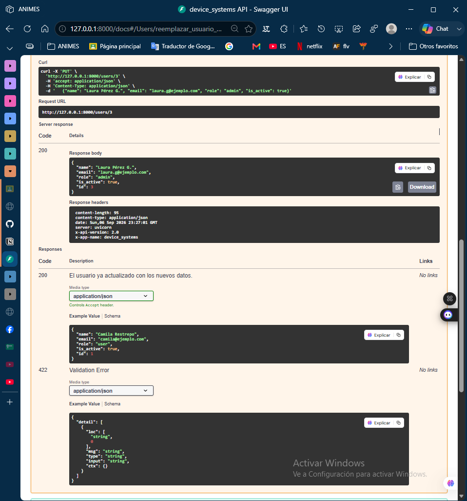
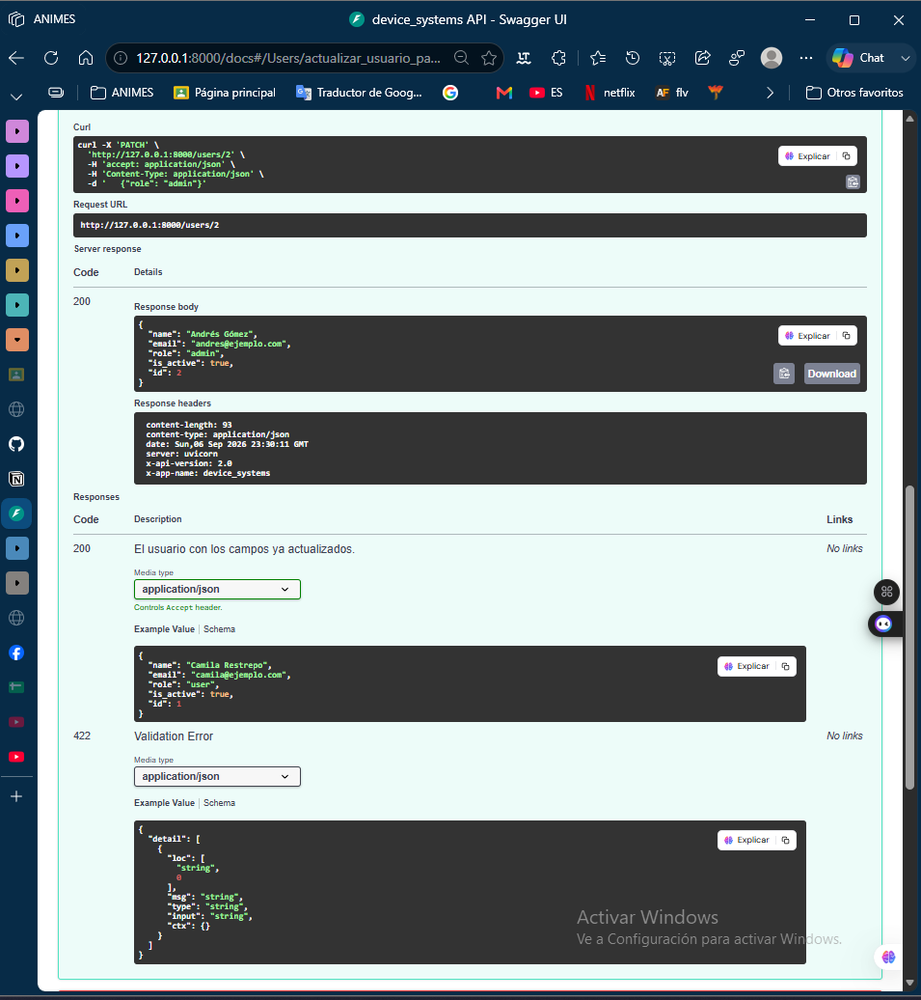
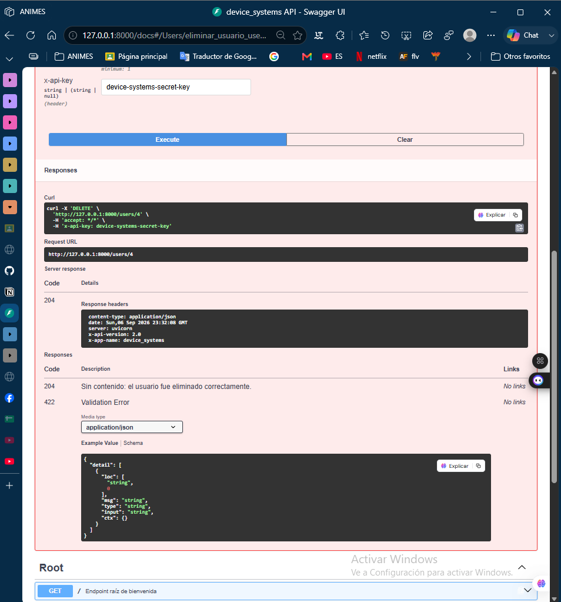
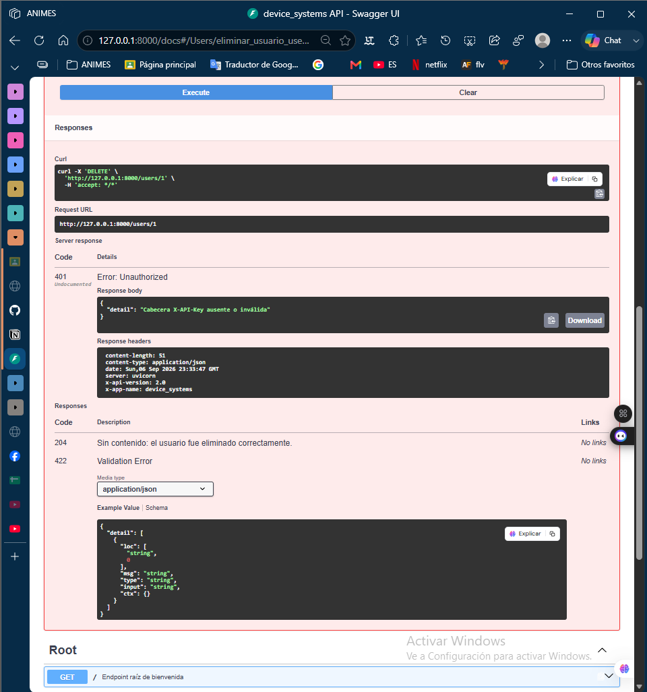

# device_systems — API REST para Gestión de Usuarios (v2.0.0)

Proyecto de las actividades **EV07 — Fundamentos de FastAPI** y **EV08 — FastAPI Intermedio**. Evolucionó de una API básica con GET/POST (v1.0.0) a una API con **CRUD completo** (PUT, PATCH, DELETE), **manejo profesional de errores**, **códigos de estado HTTP correctos**, **Swagger/OpenAPI mejorado** y **Dependency Injection** con `Depends()` (v2.0.0).

## 📋 Descripción de la API

`device_systems` gestiona el recurso `users` con las siguientes capacidades:
- **Crear**, **listar** (con filtros por rol/estado), **consultar por ID**, **actualizar completa o parcialmente**, y **eliminar** usuarios.
- Validación de datos con **Pydantic v2**.
- Manejo de errores estructurado con `HTTPException` (404, 400, 401, 422).
- **4 dependencias reutilizables** con `Depends()`: búsqueda por ID, validación de PATCH vacío, autenticación simulada por cabecera, y configuración general de la API.
- Documentación automática enriquecida en Swagger UI y ReDoc.
- Todas las respuestas incluyen **cabeceras HTTP personalizadas** (`X-App-Name`, `X-API-Version`).

Los datos se guardan en memoria (no hay base de datos externa) — suficiente para el alcance de este reto académico; el servidor arranca con 4 usuarios de ejemplo ya cargados.

## 🛠️ Tecnologías utilizadas

- **FastAPI** 0.141.1 — framework web
- **Uvicorn** 0.52.4 — servidor ASGI
- **Pydantic** 2.13.5 — validación de datos
- **email-validator** — validación de formato de correo

## 📁 Estructura del proyecto

```
device_systems/
├── app/
│   ├── main.py                     # Instancia de FastAPI, middleware, endpoint raíz
│   ├── routes/
│   │   └── user_routes.py          # Endpoints HTTP (solo reciben/traducen, no tienen lógica de negocio)
│   ├── schemas/
│   │   └── user_schema.py          # Modelos Pydantic: UserCreate, UserReplace, UserUpdate, UserResponse, UserInDB
│   ├── services/
│   │   └── user_service.py         # Lógica de negocio pura (sin HTTP)
│   ├── dependencies/
│   │   └── user_dependencies.py    # Funciones reutilizables inyectadas con Depends()
│   └── data/
│       └── users_db.py             # Simulación de base de datos en memoria
├── images/                         # Capturas de Swagger UI / ReDoc
├── requirements.txt
├── .gitignore
└── README.md
```

### ¿Por qué esta separación en capas?
- **`routes`**: solo entiende de HTTP (status codes, path/query/body). No sabe *cómo* se guarda un usuario.
- **`services`**: solo entiende de la lógica de negocio (buscar, crear, actualizar, eliminar). No sabe nada de FastAPI ni de HTTPException — podría reutilizarse en un script de consola sin cambiar una línea.
- **`dependencies`**: valida cosas que varias rutas necesitan (existencia del usuario, autorización, etc.), evitando repetir el mismo código en cada endpoint.
- **`data`**: la única fuente de verdad de los datos. Si mañana se cambia por una base de datos real, solo se toca este archivo.

## ⚙️ Instalación de dependencias

```bash
git clone https://github.com/MAICOL-ESNEIDER/device_systems.git
cd device_systems

python -m venv venv
venv\Scripts\Activate.ps1        # Windows (PowerShell)
# source venv/bin/activate       # Linux/Mac

pip install -r requirements.txt
```

## ▶️ Ejecución del servidor

```bash
uvicorn app.main:app --reload
```

- API: `http://127.0.0.1:8000`
- **Swagger UI**: `http://127.0.0.1:8000/docs`
- **ReDoc**: `http://127.0.0.1:8000/redoc`

---

## 🌐 Tabla de endpoints y códigos de estado

| Operación | Método | Ruta | Código de éxito | Código de error |
|---|---|---|---|---|
| Listar usuarios | `GET` | `/users` | 200 OK | — |
| Filtrar por rol/estado | `GET` | `/users?role=admin` / `?is_active=true` | 200 OK | — |
| Consultar por ID | `GET` | `/users/{user_id}` | 200 OK | 404 Not Found |
| Crear usuario | `POST` | `/users` | 201 Created | 400 (correo duplicado) / 422 (datos inválidos) |
| Actualizar completo | `PUT` | `/users/{user_id}` | 200 OK | 404 / 400 (correo duplicado) |
| Actualizar parcial | `PATCH` | `/users/{user_id}` | 200 OK | 404 / 400 (sin campos o correo duplicado) |
| Eliminar usuario | `DELETE` | `/users/{user_id}` | 204 No Content | 404 / 401 (sin autorización) |

Todas las respuestas incluyen las cabeceras `X-App-Name: device_systems` y `X-API-Version: 2.0`.

---

## 🧪 Ejemplos de peticiones y respuestas (probados con TestClient antes de subir)

### GET /users
```json
[
  {"name": "Camila Restrepo", "email": "camila@ejemplo.com", "role": "admin", "is_active": true, "id": 1},
  {"name": "Andrés Gómez", "email": "andres@ejemplo.com", "role": "support", "is_active": true, "id": 2},
  {"name": "Laura Pérez", "email": "laura@ejemplo.com", "role": "user", "is_active": false, "id": 3},
  {"name": "Pedro Sánchez", "email": "pedro@ejemplo.com", "role": "user", "is_active": true, "id": 4}
]
```

### GET /users?role=admin
```json
[{"name": "Camila Restrepo", "email": "camila@ejemplo.com", "role": "admin", "is_active": true, "id": 1}]
```

### GET /users/2
```json
{"name": "Andrés Gómez", "email": "andres@ejemplo.com", "role": "support", "is_active": true, "id": 2}
```

### GET /users/999 (no existe) → `404 Not Found`
```json
{"detail": "Usuario no encontrado"}
```

### POST /users (caso válido) → `201 Created`
Body:
```json
{"name": "Sofía Vargas", "email": "sofia@ejemplo.com", "role": "user", "is_active": true}
```
Respuesta:
```json
{"name": "Sofía Vargas", "email": "sofia@ejemplo.com", "role": "user", "is_active": true, "id": 5}
```

### POST /users (correo duplicado) → `400 Bad Request`
```json
{"detail": "Ya existe un usuario registrado con el correo 'sofia@ejemplo.com'"}
```

### POST /users (rol inválido) → `422 Unprocessable Entity`
```json
{"detail": [{"type": "enum", "loc": ["body", "role"], "msg": "Input should be 'admin', 'support' or 'user'", "input": "superadmin"}]}
```

### PUT /users/3 (actualización completa) → `200 OK`
Body:
```json
{"name": "Laura Pérez G.", "email": "laura.g@ejemplo.com", "role": "admin", "is_active": true}
```
Respuesta:
```json
{"name": "Laura Pérez G.", "email": "laura.g@ejemplo.com", "role": "admin", "is_active": true, "id": 3}
```

### PATCH /users/2 (actualización parcial — solo el rol) → `200 OK`
Body:
```json
{"role": "admin"}
```
Respuesta:
```json
{"name": "Andrés Gómez", "email": "andres@ejemplo.com", "role": "admin", "is_active": true, "id": 2}
```

### PATCH /users/2 (body vacío) → `400 Bad Request`
```json
{"detail": "Debes enviar al menos un campo para actualizar"}
```

### DELETE /users/4 sin cabecera de autorización → `401 Unauthorized`
```json
{"detail": "Cabecera X-API-Key ausente o inválida"}
```

### DELETE /users/4 con `X-API-Key: device-systems-secret-key` → `204 No Content`
*(sin cuerpo de respuesta)*

---

## 🔌 Explicación del uso de `Depends()` (Dependency Injection)

El proyecto define 4 dependencias en `app/dependencies/user_dependencies.py`:

| Dependencia | Qué valida | Dónde se usa |
|---|---|---|
| `get_user_or_404(user_id)` | Busca el usuario por su path parameter; lanza 404 si no existe | `GET`, `PUT`, `PATCH`, `DELETE` por ID |
| `validar_patch_no_vacio(datos)` | Verifica que el body del PATCH tenga al menos un campo distinto de `None` | `PATCH /users/{user_id}` |
| `verificar_api_key(x_api_key)` | Simula autenticación leyendo la cabecera `X-API-Key` | `DELETE /users/{user_id}` |
| `obtener_configuracion_api()` | Expone el nombre y versión de la app (dependencia sin parámetros) | `GET /` |

La ventaja principal: **`get_user_or_404` se declara una sola vez** y se reutiliza en 4 endpoints distintos. Sin `Depends()`, cada uno tendría que repetir la misma búsqueda + el mismo `if usuario is None: raise HTTPException(...)`.

> **Nota técnica:** la guía también sugiere dependencias para "validar correo duplicado" y "validar rol permitido". El rol ya queda cubierto automáticamente por Pydantic (el `Enum` del schema rechaza cualquier valor fuera de `admin/support/user` con un 422, sin código adicional). El correo duplicado sí se valida como lógica de negocio (`user_service.obtener_usuario_por_email()`), pero se invoca directamente desde las rutas en vez de como una dependencia `Depends()` separada: convertirla en dependencia recibiendo el mismo modelo Pydantic del body que ya recibe el propio endpoint hace que FastAPI interprete que hay *dos* cuerpos distintos y exija el JSON anidado en dos claves, rompiendo la petición plana que envía un cliente normal. Se priorizó una implementación simple y funcionalmente correcta sobre forzar ese patrón.

---

## ⚠️ Explicación del manejo de errores implementado

Se usa `HTTPException` en 4 escenarios distintos:

1. **Usuario no encontrado** (404) — en `get_user_or_404`, reutilizada por 4 endpoints.
2. **Correo electrónico duplicado** (400) — validado en `POST`, `PUT` y `PATCH`, excluyendo al propio usuario al actualizar (para no marcarlo como duplicado de sí mismo).
3. **PATCH sin ningún campo enviado** (400) — validado por la dependencia `validar_patch_no_vacio`.
4. **Autorización faltante en DELETE** (401) — validado por `verificar_api_key`.

Pydantic maneja automáticamente un quinto caso: **datos inválidos** (422) — nombre muy corto, correo mal formado, o rol fuera de `admin/support/user`.

---

## 🖥️ Capturas de Swagger UI y ReDoc

**Swagger UI — vista general de los endpoints:**


**Prueba GET /users:**


**Prueba GET /users/{user_id}:**


**Prueba POST /users:**


**Evidencia de validación — correo duplicado:**


**Evidencia de validación — rol inválido:**


**Prueba PUT /users/{user_id} (EV08):**


**Prueba PATCH /users/{user_id} (EV08):**


**Prueba DELETE /users/{user_id} con cabecera X-API-Key (EV08):**


**Evidencia de error controlado — DELETE sin autorización, 401 (EV08):**


**ReDoc — documentación alternativa (EV08):**


---

## 🌿 Estrategia de ramas (Git Flow)

```
main
 └── develop
      ├── feature/estructura-proyecto            (EV07 — estructura base FastAPI)
      ├── feature/modelos-pydantic               (EV07 — UserBase, UserCreate, UserResponse)
      ├── feature/endpoints-get                  (EV07 — GET /users, GET /users/{id})
      ├── feature/endpoints-post                 (EV07 — POST /users)
      ├── feature/response-models-headers        (EV07 — middleware de cabeceras)
      ├── feature/documentacion                  (EV07 — README v1)
      ├── feature/arquitectura-servicios-data     (EV08 — capas data/services)
      ├── feature/dependency-injection            (EV08 — dependencias con Depends())
      ├── feature/put-patch-delete                (EV08 — CRUD completo)
      └── feature/swagger-docs-v2                 (EV08 — metadatos v2.0.0 + README v2)
```

Cada feature se desarrolló, se probó, y se integró a `develop` con un merge commit (`--no-ff`). `develop` se fusionó en `main` dos veces: como **v1.0.0** (EV07) y como **v2.0.0** (EV08).

---

## 🧠 Reflexión sobre la evolución del proyecto

Pasar de la versión EV07 (solo GET y POST, guardando los datos directamente en el router) a esta versión con capas separadas me hizo notar cuánto crece la complejidad real de una API a medida que se le agregan operaciones. Con solo GET y POST, tener todo en un archivo no se sentía problemático; pero al agregar PUT, PATCH y DELETE — cada uno con sus propias reglas de validación — repetir la búsqueda del usuario y el manejo del 404 en cada endpoint se hubiera vuelto muy repetitivo. Ahí entendí el valor real de `Depends()`: no es solo "otra forma de recibir parámetros", es una manera de declarar una regla de validación *una sola vez* y confiar en que FastAPI la aplique donde se necesite.

La diferencia entre PUT y PATCH también se aclaró mucho al implementarlos: PUT obliga a pensar en el recurso como algo que se reemplaza entero (por eso todos los campos son obligatorios en `UserReplace`), mientras que PATCH obliga a pensar en qué pasa cuando un campo *no* se envía — ahí es donde `Optional` y `exclude_none` en Pydantic se volvieron indispensables.

Por último, separar `services` de `routes` me hizo ver una ventaja que no esperaba: al no depender de FastAPI, la lógica de negocio se puede probar y entender sin siquiera saber qué es un endpoint HTTP. Eso hace más fácil razonar sobre errores: si algo falla, sé de inmediato si el problema está en cómo se valida el HTTP o en la lógica en sí.

También aprendí (de la manera difícil, resolviendo un conflicto de Git real) que documentar bien la evolución de un proyecto importa tanto como el código: perder de vista qué evidencia ya existía de una versión anterior es un error fácil de cometer al fusionar ramas, y vale la pena revisar con calma en vez de asumir que un merge se resolvió como uno esperaba.

## 👤 Autor

Proyecto desarrollado por **Maicol Esneider** como evidencia de aprendizaje de las actividades *Fundamentos de FastAPI* (EV07) y *FastAPI Intermedio: Evolución con CRUD Completo* (EV08).